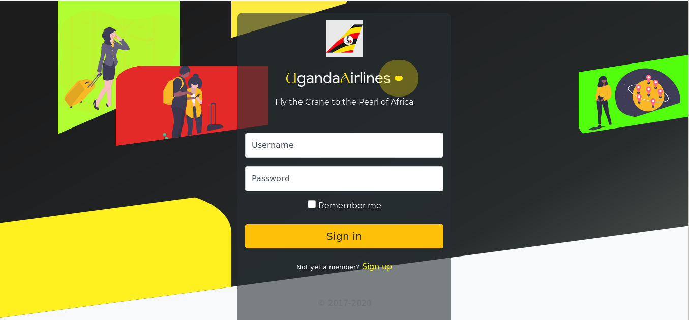
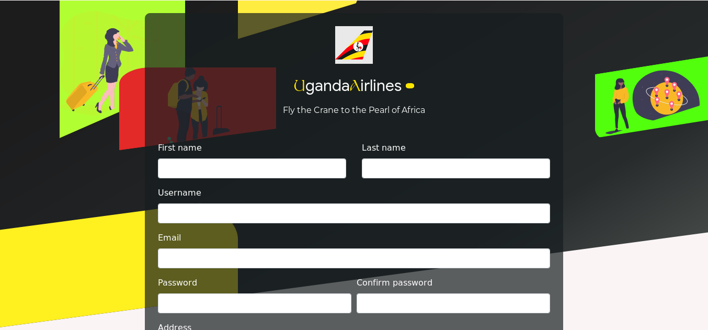
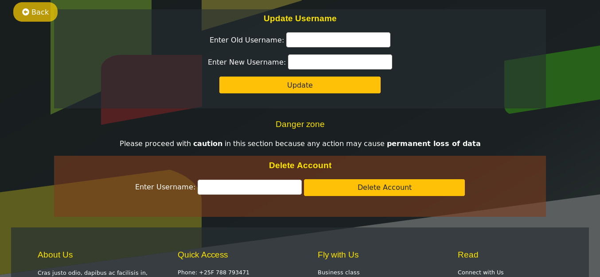

# __PHP Project__
___

## Uganda Airlines Website

___

### responsive Airline website
> Based off the Uganda Airlines website.

### Designed By
  > [ochenhillary](https://github.com/occn8)

## Running Project
* [x] __Make sure__ xampp or `any-other` is started or running
* [x] __Move__ the project folder(php101) to location 'PWD'/lampp/htdocs/
* [x] __Then__ Paste this URL `http://localhost/php101/bin/index.php` to your browser
* [x] __Done__

### License

    Copyright 2020 ochen hillary

    Licensed under the Apache License, Version 2.0 (the "License");
    you may not use this file except in compliance with the License.
    You may obtain a copy of the License at

       http://www.apache.org/licenses/LICENSE-2.0

    Unless required by applicable law or agreed to in writing, software
    distributed under the License is distributed on an "AS IS" BASIS,
    WITHOUT WARRANTIES OR CONDITIONS OF ANY KIND, either express or implied.
    See the License for the specific language governing permissions and
    limitations under the License.

## Screenshots
`LogIn screen`

`___Register screen___`

`Update & Delete screen`
